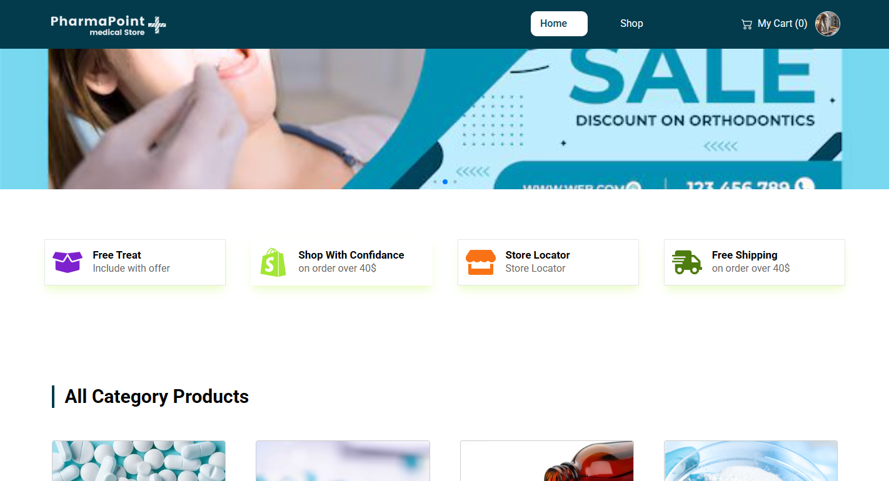

## PharmaPoint [Multi-Vendor Medicine Selling E-commerce Website]
This is a full-stack web application for selling medicines online. The website includes an admin panel, seller and user dashboards, payment systems, private routing, and data visualizations. The site is built with React, MongoDB, and various modern web technologies.

## Key Features
1. **Admin Dashboard**: Admin panel for managing the entire platform, including users, sellers, and products, advertise.
2. **Seller Dashboard**: A dedicated space for sellers to manage their inventory, orders, and sales.
3. **User Dashboard**: Users can manage their orders, track delivery status
4. **Payment System**: Integrated payment gateway to handle transactions securely.
5. **Private Routing**: Secure pages with restricted access for unauthorized users.
6. **Data Visualization**: Uses Recharts to display sales trends and other analytics for the admin and sellers.
7. **Product Catalog**: View a wide range of medicines with detailed information, prices, and availability.
8. **Search and Filter**: Users can search for medicines and apply filters based on categories, brands, and prices.
9. **Responsive Design**: Desktop, laptop and Mobile-friendly design that works seamlessly across devices.
10. **Authentication**: User authentication with JWT for secure login, registration

## Tech Stack
- **Frontend**: React, React Router,react awesome componants,  Recharts , Tailwind CSS (for styling),daisyUI.
- **Backend**: Node.js, Express.js
- **Database**: MongoDB
- **Authentication**: JWT (JSON Web Tokens)
- **Payment**: Stripe 
- **Routing**: React Router (for client-side routing)
- **Design**: Tailwind CSS, Figma (for design mockups),daisyUi

## Packages & Libraries
- `react`: Frontend library for building user interfaces.
- `react-router-dom`: For routing in React applications.
- `recharts`: For data visualization and charts.
- `tailwindcss`: Utility-first CSS framework for fast styling.
- `axios`: For making API requests.
- `jsonwebtoken`: To manage JWT-based authentication.
- `stripe`: For integrating Stripe payment gateway (or `paypal-rest-sdk` for PayPal).
- `mongoose`: MongoDB ORM for handling database operations.
- `dotenv`: For environment variable management.

## Design Tools
- **Figma**: Used to design the layout and user interface of the website.

## Highlight Features of the Website

### Seamless User Experience
The **Medicine Selling Website** offers a smooth and intuitive experience for users, sellers, and admins alike. Whether you are buying medicines or managing products, the platform provides a highly functional interface.

### Advanced Seller & Admin Dashboards
With dedicated dashboards for both **sellers** and **admins**, users have full control over their sales, products, and analytics. Admins can manage the entire platform, from user accounts to product listings, while sellers can focus on their individual businesses.

### Secure Payment Gateway
The integration of a reliable **payment system** ensures safe and secure transactions for users. Whether you're buying medicines or processing orders, the payment system is seamless and robust, supporting popular payment gateways like **Stripe**.

### Real-Time Data Insights with Recharts
With **Recharts**, the platform provides insightful analytics for both admins and sellers. Visualizing sales trends, orders, and other key metrics helps to make better business decisions.

### Secure Authentication & Routing
The site uses **JWT authentication** for secure user login and protected routes for dashboards and sensitive pages. Unauthorized users cannot access private areas of the website.

### Responsive & Mobile-Friendly Design
The platform is designed to work perfectly on both **desktop and mobile** devices. Thanks to **Tailwind CSS**, the website adapts seamlessly to any screen size, ensuring an optimal user experience across all devices.

## Adding a Banner Image to the Website

To add a banner image to your website, follow these steps:

1. **Home page**  
   
1. **Admin Dashboard page**  
   

## Admin User Email & Password

admin mail : ayeshaadmin123@gmail.com
admin pass : AYEsha123@#

## Live Site Link
[https://pharmapoint123.netlify.app/]

seller mail : ayeshaseller123@gmail.com
seller pass : AYEsha123@#
